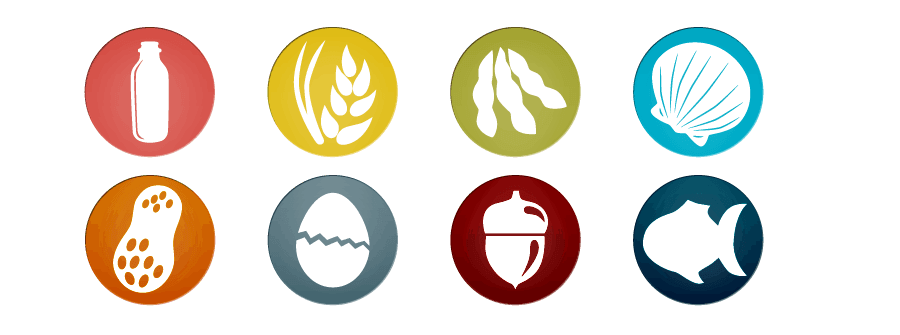

<h1 align="center">
   
  
   
  Allergy Assist App
   
</h1>

<h4 align="center">A <a href="https://hci.cs.illinois.edu/cs-465-advanced-topics-in-human-computer-interaction/" target="_blank">CS465</a> application.</h4>

  <a href="#key-features">Key Features</a> •
  <a href="#how-to-use">How To Use</a> •
  <a href="#license">License</a>

## Key Features
Helping users find meals without having to fear for their lives since 2020

## How To Use
1. Clone this repo into your local directory
1. Install expo-cli with `npm install expo-cli --global`
2. Install dependencies with `yarn install`
2. Start the app with `expo start`
3. Open a real-time hot reload preview with on the `Expo` app by scanning the QR code!

### Want to see the app in action?
See our Final User Evaluation Presentation here: https://docs.google.com/presentation/d/1mJSZ58W3dd4nOWEs1GrWFLovjKzoAduSc5lWbgKWgAE/edit?usp=sharing

## Team
Made by Lam Tran, Evan Eckels, Sabrina Li, David-Fernandez Wang, Alex Li Fall 2020.
